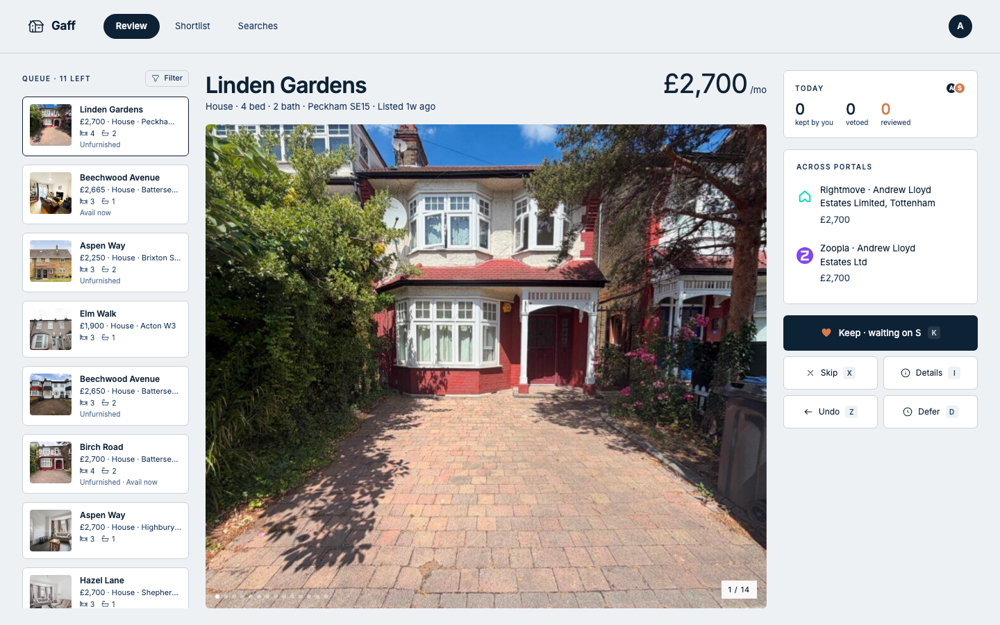
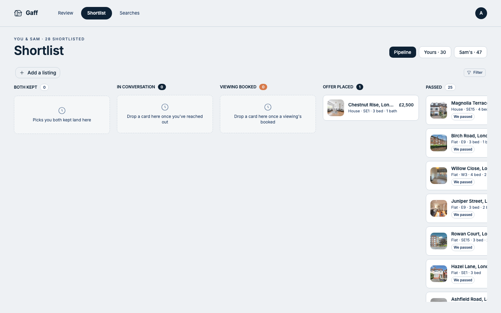
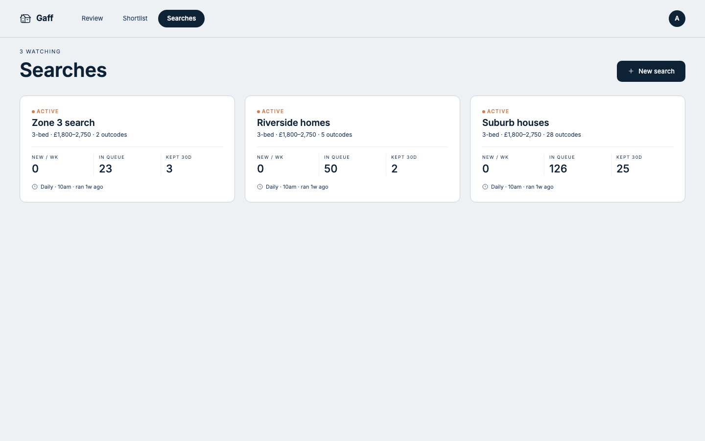
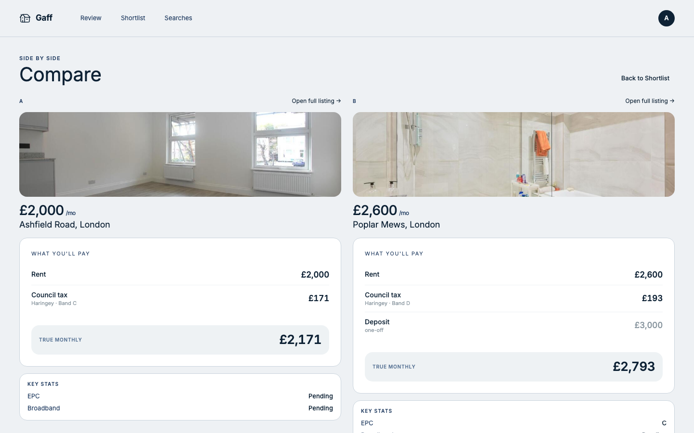
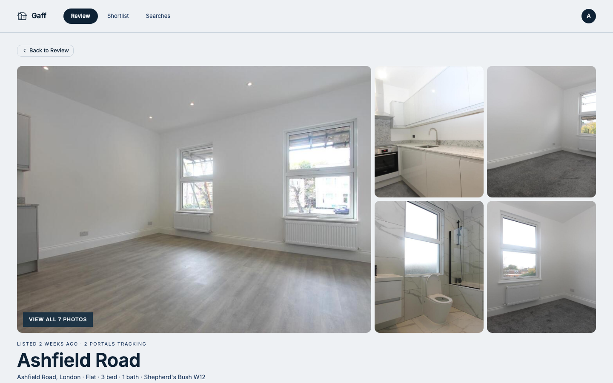
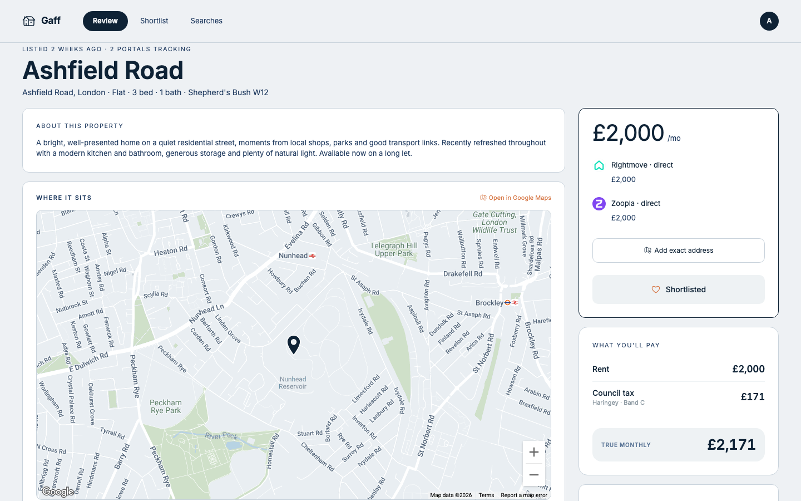
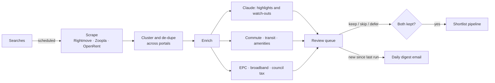

<div align="center">

# 🏡 Gaff

**A collaborative rental-hunting tool for two people sharing one search.**

Gaff scrapes UK letting portals, de-duplicates the same flat across them, enriches every
listing with the facts that actually decide a tenancy — commute, council tax, broadband,
crime, energy rating — and turns the hunt into a shared swipe-and-shortlist game between
two people. When you both keep the same place, it surfaces as a match.

<sub>TanStack Start · Cloudflare Workers · Neon Postgres · Trigger.dev · Claude</sub>

</div>

> [!NOTE]
> **Archived personal project.** Gaff was built for one real two-person house hunt. The
> hosted instance and its cloud infrastructure have been retired — this repo is the
> source, kept public as a reference. Everything is parameterised so you can stand up your
> own instance from scratch (see **[Deploy](#-deploy-your-own)**).

<br />



## What it does

House-hunting as a couple means two browsers, three portals, the same flat listed three
times at three prices, and no shared memory of "did we both like that one?". Gaff replaces
that with a single queue:

- **One feed across portals.** Rightmove, Zoopla and OpenRent are scraped on a schedule and
  the same property — listed and priced differently on each — is clustered into one card.
- **Decisions, not tabs.** Review listings one at a time with keyboard shortcuts
  (keep / skip / defer). A skip is personal; a *mutual* keep becomes a match.
- **The facts that matter, pre-loaded.** Each listing is enriched with commute times to your
  stations, council-tax band, FTTP broadband availability, EPC rating, nearby amenities and
  an AI read of what stands out and what to watch for.
- **A shared shortlist.** Matches flow into a kanban pipeline — *both kept → in conversation
  → viewing booked → offer placed* — so two people track one hunt without a spreadsheet.
- **A daily digest.** When a search finishes scraping, each person gets an email rounding up
  what's new and waiting to review.

## Screens

|  |  |
|--|--|
| **Review** — swipe the queue, filter by beds/price/commute/EPC | **Shortlist** — kanban pipeline of mutual matches |
|  |  |
| **Searches** — per-area searches on independent schedules | **Compare** — two listings side by side, true monthly cost |
|  |  |

### Listing detail

Every clustered property opens to a full dossier — gallery, cross-portal price tracking, a
map with transit times, and the public records (EPC, broadband, council tax, amenities)
pulled in by the enrichment pipeline.

| Photo gallery | Cross-portal price, council tax & map |
|--|--|
|  |  |

## How it works



Scraping, clustering and enrichment run as [Trigger.dev](https://trigger.dev) tasks; the web
app reads the results. The review queue and the digest share one selection module so the
email can never promise listings the queue would filter out.

## Architecture

| Layer | Choice |
|------|--------|
| Web framework | [TanStack Start](https://tanstack.com/start) (React 19, Router, Query) |
| Runtime | Cloudflare Workers (SSR + bindings) |
| Database | [Neon](https://neon.tech) Postgres + [Drizzle ORM](https://orm.drizzle.team) |
| Background jobs | [Trigger.dev](https://trigger.dev) (scrape · cluster · enrich · email) |
| Auth | [Better Auth](https://better-auth.com) behind Cloudflare Access (Zero Trust) |
| Object storage | Cloudflare R2 (cached, right-sized listing photos) |
| AI enrichment | Anthropic Claude |
| Email | [Resend](https://resend.com) + [React Email](https://react.email) |
| Secrets | [Doppler](https://doppler.com) (runtime injection, nothing on disk) |
| Infra as code | [Pulumi](https://pulumi.com) (KV · R2 · DNS · Access) |
| Tooling | Bun · Biome · Vitest · `t-stack` |

## Develop

```sh
bun install

# Configure local secrets (Doppler project `gaff`, config `dev`)
bash scripts/setup-doppler.sh

bun run dev          # web + Trigger.dev dev server (mprocs)
bun run db:migrate   # apply migrations to your Neon branch
```

See **[`.env.example`](.env.example)** for every variable the app reads.

## 🚀 Deploy your own

Gaff runs on free tiers of Cloudflare, Neon and Trigger.dev. Standing up a fresh instance
means creating a handful of accounts, dropping their keys into Doppler, provisioning the
Cloudflare resources with Pulumi, and pushing.

**→ Full walkthrough: [`docs/DEPLOY.md`](docs/DEPLOY.md)**

The short version:

```sh
# 1. Accounts: Cloudflare, Neon, Trigger.dev, Doppler, Anthropic, Google Maps,
#    Zyte, EPC Open Data, Resend (see docs/DEPLOY.md for what each is for)
# 2. Put their keys in Doppler (gaff/dev + gaff/prd) — checklist in .env.example
# 3. Set your own values: domain, org and IDs (see "Make it yours" in DEPLOY.md)
t-stack provision      # Cloudflare KV, R2, DNS, Access via Pulumi
bun run db:migrate:prod
bun run deploy         # build + wrangler deploy
```

## License

[MIT](LICENSE) — do whatever you like with it.
