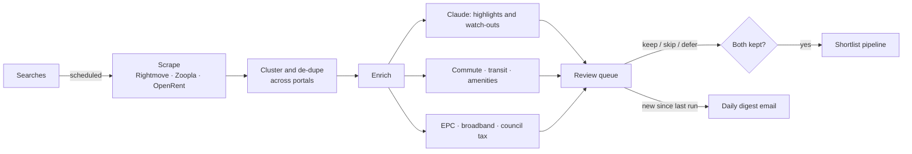

<div align="center">

# 🏡 Gaff

**Collaborative UK rental hunting for two people sharing one search.**

Gaff scrapes the big letting portals, spots the same flat listed across all of them, and adds
the facts that actually decide a tenancy: commute, council tax, broadband, energy rating. Then
two people swipe through the results and build a shared shortlist. When you both keep the same
place, it becomes a match.

<sub>TanStack Start · Cloudflare Workers · Neon · Trigger.dev</sub>

</div>

> [!NOTE]
> Archived personal project. Gaff was built for one real two-person house hunt. The hosted
> instance and its infrastructure have been retired, so this repo is just the source, kept
> public as a reference. It's parameterised so you can run your own (see [Deploy](#-deploy-your-own)).

<br />


## What it does

House-hunting as a couple usually means two browsers, three portals, the same flat listed three
times at three prices, and no shared memory of "did we both like that one?". Gaff turns all of
that into a single queue.

- **One feed across portals.** Rightmove, Zoopla and OpenRent are scraped on a schedule. The same
  property, listed and priced differently on each, is grouped into one card.
- **Decisions, not tabs.** Review one listing at a time with keyboard shortcuts (keep, skip,
  defer). A skip is yours alone. A keep that you both make becomes a match.
- **The facts up front.** Every listing carries commute times to your stations, council tax band,
  broadband availability, energy rating, nearby amenities, and a short written read of what stands
  out and what to watch for.
- **A shared shortlist.** Matches flow into a pipeline: both kept, in conversation, viewing booked,
  offer placed. Two people track one hunt without a spreadsheet.
- **A daily digest.** When a search finishes scraping, each of you gets an email of what's new and
  waiting to review.

## Screens

|  |  |
|--|--|
| **Review** the queue, filter by beds, price, commute, EPC | **Shortlist** pipeline of mutual matches |
|  |  |
| **Searches** on independent schedules | **Compare** two listings, true monthly cost |
|  |  |

### Listing detail

Every clustered property opens to a full dossier: photo gallery, cross-portal price tracking, a
map with transit times, and the public records (EPC, broadband, council tax, amenities) pulled in
by the enrichment pipeline.

| Photo gallery | Price, council tax & map |
|--|--|
|  |  |

## How it works



Scraping, clustering and enrichment run as [Trigger.dev](https://trigger.dev) jobs. The web app
just reads the results. The review queue and the digest share one selection module, so the email
can never promise listings the queue would then filter out.

## Stack

TanStack Start (React 19) on Cloudflare Workers, Neon Postgres with Drizzle, Trigger.dev for
background jobs, Better Auth behind Cloudflare Access, R2 for cached photos, Claude for the
written summaries, Resend + React Email for mail, Doppler for secrets, Pulumi for infra. Bun,
Biome and Vitest for tooling.

## Develop

```sh
bun install
bash scripts/setup-doppler.sh   # Doppler project `gaff`, config `dev`
bun run dev                     # web + Trigger.dev dev server
bun run db:migrate              # migrate your Neon branch
```

See [`.env.example`](.env.example) for every variable the app reads.

## 🚀 Deploy your own

Gaff runs on free tiers of Cloudflare, Neon and Trigger.dev. Standing up a fresh instance means
creating a few accounts, dropping their keys into Doppler, provisioning the Cloudflare resources
with Pulumi, and pushing.

Full walkthrough: [`docs/DEPLOY.md`](docs/DEPLOY.md). The short version:

```sh
# 1. Accounts: Cloudflare, Neon, Trigger.dev, Doppler, Anthropic, Google Maps,
#    Zyte, EPC Open Data, Resend (docs/DEPLOY.md says what each is for)
# 2. Put their keys in Doppler (gaff/dev + gaff/prd); checklist in .env.example
# 3. Set your own domain, org and IDs ("Make it yours" in DEPLOY.md)
t-stack provision      # Cloudflare KV, R2, DNS, Access via Pulumi
bun run db:migrate:prod
bun run deploy         # build + wrangler deploy
```

## License

[MIT](LICENSE).
